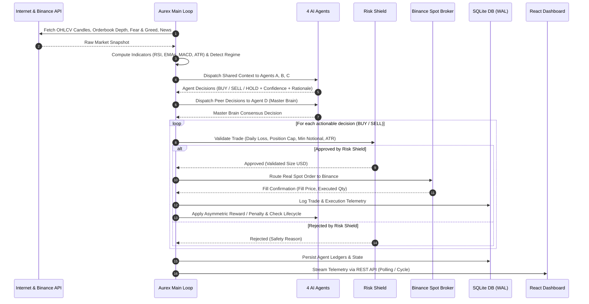
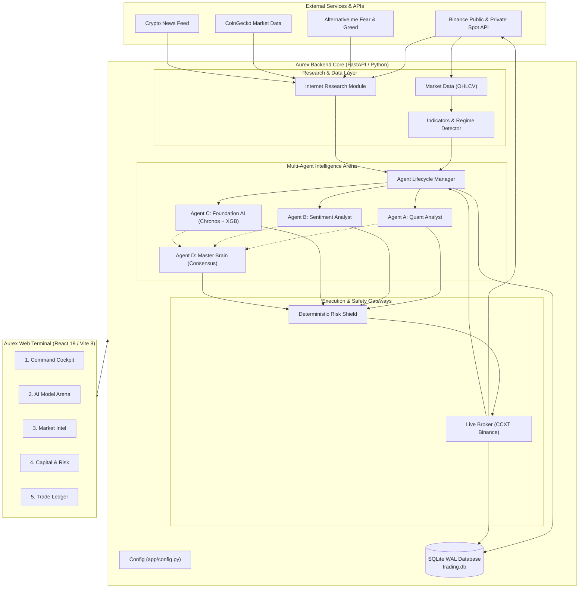

# Aurex — Autonomous Multi-Agent AI Cryptocurrency Trading Engine

[](https://www.python.org/)
[](https://fastapi.tiangolo.com)
[](https://react.dev/)
[](https://www.typescriptlang.org/)
[](https://github.com/ccxt/ccxt)
[-003B57.svg?style=flat&logo=sqlite&logoColor=white)](https://www.sqlite.org/)
[](https://opensource.org/licenses/MIT)

> **Aurex** is a 24/7 autonomous multi-agent algorithmic trading engine for **BTC/USDT spot markets** on Binance. It deploys a team of four specialized AI models that independently research live market data, synthesize competitive trading signals, execute spot orders, and evolve through an asymmetric survival and capital-rebalancing lifecycle—strictly bounded by a deterministic Risk Shield.

---

## Quick Overview (1-Minute Read)

| Question | Answer |
| :--- | :--- |
| **What is Aurex?** | An autonomous cryptocurrency trading system powered by 4 independent AI agents, a deterministic safety shield, real Binance spot execution, and an institutional dark-themed React dashboard. |
| **What problem does it solve?** | Eliminates single-model fragility, emotional biases, manual execution delays, and the catastrophic drawdown risks typical of "black-box" trading bots. |
| **How does it solve it?** | Employs 4 distinct AI agents (Quant, Sentiment, Foundation, and Master Brain) that research technicals, live orderbook depth, Fear & Greed sentiment, and news in real time. Winning models earn capital and rewards; failing models are degraded or deactivated. |
| **What makes it unique?** | **No blind AI execution.** Every proposed trade must pass an uncompromising, non-ML **Deterministic Risk Shield** (daily drawdown caps, position caps, minimum notional validation, and circuit breakers) before reaching Binance. |

```
                       ┌──────────────────────────────────────────────┐
                       │           LIVE INTERNET & BINANCE            │
                       │   OHLCV · Orderbook Depth · F&G · News NLP   │
                       └──────────────────────┬───────────────────────┘
                                              ▼
                       ┌──────────────────────────────────────────────┐
                       │          4 SPECIALIZED AI AGENTS             │
                       │   Quant · Sentiment · Foundation · Master    │
                       └──────────────────────┬───────────────────────┘
                                              ▼
                       ┌──────────────────────────────────────────────┐
                       │           DETERMINISTIC RISK SHIELD          │
                       │   Hard Invariants: Drawdown, Size, Capital   │
                       └──────────────────────┬───────────────────────┘
                                              ▼
                       ┌──────────────────────────────────────────────┐
                       │              BINANCE SPOT (CCXT)             │
                       │          Real Live / Testnet Execution       │
                       └──────────────────────┬───────────────────────┘
                                              ▼
                       ┌──────────────────────────────────────────────┐
                       │     SURVIVAL LEDGER & CAPITAL REBALANCING    │
                       │     Rewards, Penalties, Death Deactivation   │
                       └──────────────────────────────────────────────┘
```

---

## The Problem It Solves

Automated trading in cryptocurrency markets presents severe systemic challenges:

1. **Single-Model Fragility**: Traditional algorithmic bots rely on a single indicator or monolithic ML model. When market conditions shift from trending to high volatility, single-strategy systems fail catastrophically.
2. **"Black Box" Hallucinations**: Deep learning and LLM-driven trading agents can output erratic positions during market anomalies if allowed unrestricted execution.
3. **Absence of Hard Capital Governance**: Many trading bots lack rigid capital-preservation mechanics, continuing to place trades while in steep drawdowns until the entire account is liquidated.
4. **Paper-Trading Delusions**: Theoretical backtests often ignore live orderbook depth, real taker fees, exchange minimum notional rules, and network execution slippage.

---

## How Aurex Solves the Problem

Aurex addresses these challenges with a defense-in-depth architecture:

- **Decentralized Multi-Agent Diversity**: Rather than trusting one model, four distinct analytical frameworks independently evaluate each cycle.
- **Asymmetric Survival Game Mechanics**: Models are held accountable for their financial performance. Profitable decisions earn reward points and capital; losing decisions are penalized at a **2× asymmetric severity**. If an agent loses its allocated capital or incurs heavy penalties, it is marked **DEAD**, deactivated, and its remaining funds are distributed to surviving models.
- **Deterministic Risk Shield Gatekeeper**: An independent layer of hard-coded rules validates every proposed trade. The AI cannot bypass, modify, or override the Risk Shield.
- **Real-World Binance Execution**: Native CCXT integration with live market filter caching (tick sizes, step sizes, and minimum notional values) ensures zero invalid orders reach the exchange.

---

## How It Works

Each autonomous trading cycle runs through a sequential pipeline:



---

## Key Features

- **24/7 Autonomous Background Loop**: Runs unattended on a configurable schedule (default: 15–30 seconds), continuously refreshing market data, evaluating models, and managing open positions.
- **Four Specialized AI Agents**:
  - **Quant Analyst**: Rule-based technical indicators (RSI, EMA crossovers, MACD, ATR) combined with live Binance orderbook bid/ask imbalance.
  - **Sentiment Analyst**: Internet research engine analyzing Alternative.me Fear & Greed, CoinGecko 24h momentum, and crypto news headline sentiment.
  - **Foundation AI**: Time-series forecasting via Amazon Chronos-Bolt paired with dual-stage XGBoost Triple-Barrier direction classification and Meta-Labeler precision gating.
  - **Master Brain**: Meta-arbitrator performing democratic, performance-weighted consensus aggregation across all active peer models.
- **Zero-Cost Internet Market Intelligence**: Fetches live research from public endpoints without requiring expensive third-party data subscriptions.
- **Asymmetric Survival & Capital Rebalancing**:
  - `ACTIVE`: Standard operations.
  - `DEGRADED`: Score drops below `-50`; trading size is cut by 50% and confidence hurdle increases.
  - `DEAD`: Score drops below `-100` or capital falls below 5%; model is deactivated and its remaining capital is rebalanced to surviving peers.
- **Institutional Risk Shield**: Non-negotiable rules enforce daily drawdown caps (4%), max risk per trade (1–2%), single position limits, minimum notional gates ($10.00), and volatility dampening.
- **Emergency Hardware Kill-Switch**: One-click UI button or filesystem flag (`EMERGENCY_STOP`) halts all trading immediately.
- **Pro Max Dark Terminal Interface**: High-density fintech dashboard built with React 19, Vite 8, TypeScript, and tabular numeric typography.

---

## AI Agents and Their Roles

Aurex divides capital equally among four specialized trading agents:

| Agent | Identifier | Analytical Strategy | Primary Data Inputs | Decision Logic |
| :--- | :--- | :--- | :--- | :--- |
| **Quant Analyst** | `agent_quant` | Technical Indicators & Market Microstructure | 1h OHLCV (RSI, EMA 9/21/50, MACD, ATR) + Top-20 Binance Orderbook Depth | Evaluates indicator confluence and bid/ask liquidity wall imbalances. |
| **Sentiment Analyst** | `agent_sentiment` | Contrarian & Momentum Internet Research | Fear & Greed Index, CoinGecko 24h Volume/Price Change, Breaking Crypto News | Fades extreme sentiment (contrarian BUY on extreme fear, SELL on extreme greed) and follows confirmed momentum. |
| **Foundation AI** | `agent_foundation` | Machine Learning & Probabilistic Forecasting | Amazon Chronos-Bolt Zero-Shot Predictions + XGBoost Triple-Barrier Classifier | Generates directional probabilities gated by a secondary Meta-Labeler predicting $P(\text{Trade Net Profit} > \text{Fees})$. |
| **Master Brain** | `agent_master` | Performance-Weighted Consensus Meta-Model | Peer decisions, confidence levels, and active agent reward scores | Weighs active peer votes proportionally to their historical reward scores. Requires a minimum 2-agent majority to open or close trades. |

---

## Trading & Decision-Making Workflow

1. **Data Ingestion**: Fetch current 1h candles from Binance, compute RSI, EMAs (9, 21, 50), MACD, and ATR normalized volatility. Detect market regime (`BULL`, `BEAR`, `SIDEWAYS`, `HIGH_VOL`).
2. **Internet Research**: Query Alternative.me Fear & Greed index, Binance top-20 orderbook depth, CoinGecko metrics, and CryptoPanic news feeds (cached for 120s).
3. **Specialist Evaluation**: Agents A, B, and C independently execute their `decide(context)` methods, returning an action (`BUY`, `SELL`, or `HOLD`), a confidence score (`0.00` to `1.00`), and a human-readable rationale.
4. **Master Consensus**: Agent D ingests the decisions of Agents A, B, and C, scales their votes by their current reward scores, and calculates a net consensus stance.
5. **Hurdle Verification**: An agent's confidence must meet or exceed its dynamic `confidence_hurdle` (`0.60` standard, `0.75+` if degraded).
6. **Risk Shield Gate**: The proposed trade size is calculated (`cash * size_multiplier`) and submitted to `RiskShield.check()`.
7. **Execution**: If approved, `LiveBroker` sends the spot order to Binance via CCXT, records fill prices, and tracks open position quantities.

---

## Reward, Punishment, and Agent Lifecycle

Each agent maintains its own balance sheet and performance ledger. Outcomes are applied at position close:

### Mathematical Formulations

$$\text{Return Factor } (f) = \frac{\text{Net Realized PnL (after fees)}}{\text{Original Position Size (USD)}}$$

- **Profitable Trade (Reward)**:
  $$\Delta \text{Score} = f \times 500.0$$
- **Losing Trade (Asymmetric Punishment)**:
  $$\Delta \text{Score} = f \times 1000.0 \quad (2\times \text{ penalty severity})$$

### Lifecycle State Machine

```
              ┌──────────────────────────────────────────────┐
              │                    ACTIVE                    │
              │   Score > -50 · Hurdle: 60% · Size: 80%      │
              └───────┬──────────────────────────────▲───────┘
                      │                              │
         Score ≤ -50  │                              │  Score > -50
                      ▼                              │
              ┌──────────────────────────────────────┴───────┐
              │                   DEGRADED                   │
              │   Score ≤ -50 · Hurdle: 75% · Size: 40%      │
              └───────┬──────────────────────────────────────┘
                      │
   Score ≤ -100  OR   │
   Cash ≤ 5% Capital  │
                      ▼
              ┌──────────────────────────────────────────────┐
              │                     DEAD                     │
              │   Deactivated · 0 Trades · Funds Rebalanced  │
              └──────────────────────────────────────────────┘
```

- **ACTIVE**: Normal trading authority.
- **DEGRADED**: Triggered when `reward_score <= -50.0`. The agent's position size multiplier is cut from `0.80` to `0.40`, and its confidence hurdle increases to `min(0.85, base + 0.15)`.
- **DEAD**: Triggered if `reward_score <= -100.0` or cash falls below the **5% Survival Floor** ($2.50 for a $50 portfolio). The model is permanently halted from opening trades, its remaining cash is recovered, and it is divided equally among surviving active models.

---

## Risk Management & Capital Protection

The **Risk Shield** (`app/risk/risk_shield.py`) is a deterministic, non-probabilistic safety layer. It enforces strict invariants:

| Parameter | Rule / Gate | Enforcement Logic |
| :--- | :--- | :--- |
| **Max Risk per Trade** | `MAX_RISK_PER_TRADE` (1.0%–2.0%) | Limits single order capital exposure relative to available balance. |
| **Daily Drawdown Breaker** | `MAX_DAILY_LOSS` (4.0%) | If cumulative daily realized losses reach 4% of initial capital, all trading halts until the next UTC day. |
| **Position Cap** | `MAX_OPEN_POSITIONS` (1) | Prohibits multiple simultaneous open positions to prevent overexposure. |
| **Minimum Notional Gate** | `MIN_NOTIONAL_USD` ($10.00) | Validates orders against Binance's minimum exchange order requirement ($10 USDT). |
| **Volatility Governor** | Normalized ATR > 5.0% | Halves the approved position size during extreme market volatility. |
| **Emergency Kill-Switch** | `EMERGENCY_STOP` File Flag | File existence immediately rejects 100% of new trade proposals. |

---

## Technology Stack

### Backend & Machine Learning
- **Language**: Python 3.10+
- **API Framework**: FastAPI 0.111+ & Uvicorn (Asynchronous REST API)
- **Exchange Connectivity**: CCXT 4.2+ (Binance Spot REST API)
- **Database**: SQLite3 with Write-Ahead Logging (`PRAGMA journal_mode=WAL;`)
- **Forecasting & ML**: Amazon Chronos-Bolt (`chronos-bolt-small`), XGBoost, Scikit-Learn, PyTorch, Transformers
- **Data Analysis**: Pandas 2.0+, NumPy, Requests

### Frontend Dashboard
- **Framework**: React 19
- **Build Tool**: Vite 8
- **Language**: TypeScript 5
- **Icons & Visuals**: Lucide React
- **Charting**: Recharts
- **Styling**: Vanilla CSS Design System (Pro Max Dark Palette with Zero Emojis)

---

## System Architecture



---

## Project Structure

```
bot/
├── app/
│   ├── agents/                   # Autonomous Multi-Agent Arena
│   │   ├── base_agent.py         # Abstract BaseAgent contract & reward/penalty formulas
│   │   ├── foundation_agent.py   # Agent C: Chronos-Bolt forecasting + XGBoost classifier
│   │   ├── lifecycle.py          # Lifecycle Manager: capital splits & rebalancing
│   │   ├── master_agent.py       # Agent D: Performance-weighted consensus meta-agent
│   │   ├── quant_agent.py        # Agent A: Rule-based technicals & orderbook depth
│   │   └── sentiment_agent.py    # Agent B: Fear & Greed + CoinGecko + News sentiment
│   ├── ai/                       # Classical ML & Decision Engineering
│   │   ├── confidence.py         # Multi-factor confidence estimation
│   │   ├── explainability.py     # Decision rationale generation
│   │   ├── feature_engineering.py# Quantitative technical feature extraction
│   │   ├── meta_labeler.py       # Secondary probability gate (P(Profit > Fees))
│   │   ├── predict.py            # Model inference interface
│   │   └── train.py              # XGBoost model training pipeline
│   ├── data/                     # Market Data Pipeline
│   │   ├── indicators.py         # RSI, EMA (9/21/50), MACD, ATR calculations
│   │   ├── market_data.py        # Binance spot candle ingestion
│   │   └── preprocessing.py      # OHLCV validation & cleaning
│   ├── database/                 # Persistence Layer
│   │   └── db.py                 # SQLite schema, WAL mode, trade & agent ledgers
│   ├── execution/                # Exchange Execution Layer
│   │   └── live_broker.py        # CCXT Binance spot broker with market filter caching
│   ├── forecasting/              # Foundation Forecasting Models
│   │   ├── chronos_model.py      # Amazon Chronos-Bolt zero-shot time-series forecasting
│   │   └── forecast_features.py  # Probabilistic expected return feature extraction
│   ├── monitoring/               # Logging & Health Infrastructure
│   │   └── logger.py             # Structured institutional logging setup
│   ├── regime/                   # Market State Classification
│   │   └── detector.py           # Volatility and trend regime classification
│   ├── research/                 # Real-Time Internet Intelligence
│   │   └── internet.py           # Free public endpoints (F&G, L2 Depth, CoinGecko, News)
│   ├── risk/                     # Deterministic Safety Architecture
│   │   └── risk_shield.py        # Hard risk gates, daily loss caps, emergency flags
│   ├── config.py                 # Centralized configuration dataclass
│   └── main.py                   # FastAPI backend server & 24/7 background worker loop
├── dashboard/                    # React 19 Frontend Web Terminal
│   ├── src/
│   │   ├── assets/               # Branding assets
│   │   ├── components/           # UI Components
│   │   │   ├── AgentsCard.tsx    # AI Model Arena card & rationales
│   │   │   ├── CapitalCard.tsx   # Capital matrix & Risk Shield diagnostics
│   │   │   ├── ConfidenceRing.tsx# SVG circular confidence ring visualizer
│   │   │   ├── EquityChart.tsx   # Performance equity curve visualizer
│   │   │   ├── ResearchCard.tsx  # Market intel, radial gauge & news terminal
│   │   │   ├── SignalCard.tsx    # Consensus telemetry & voting breakdown
│   │   │   └── TradesTable.tsx   # Multi-agent trade ledger with filters
│   │   ├── api.ts                # Backend API client bindings
│   │   ├── App.tsx               # Main command deck, 5-tab workspace & shortcuts
│   │   ├── index.css             # Pro Max dark design system & tokens
│   │   ├── main.tsx              # React application root entrypoint
│   │   └── types.ts              # TypeScript interfaces and data models
│   ├── index.html                # HTML5 application shell & font imports
│   ├── package.json              # Frontend npm dependencies & build scripts
│   ├── tsconfig.json             # TypeScript compiler settings
│   └── vite.config.ts            # Vite 8 build configurations
├── data/                         # Persistent runtime databases (.gitignore protected)
├── logs/                         # Runtime logs (.gitignore protected)
├── models/                       # Pre-trained ML models (.pkl weights)
├── .env.example                  # Safe configuration template (NO real keys)
├── .gitignore                    # Comprehensive secrets and artifact exclusions
├── project.md                    # Detailed architectural and research specifications
├── requirements.txt              # Python package dependencies
└── README.md                     # Production system documentation
```

---

## Installation

### Prerequisites
- **Python**: Version `3.10` or higher
- **Node.js**: Version `18.0.0` or higher (with `npm`)
- **Binance Account**: Standard account with Spot trading enabled (or Spot Testnet credentials)

### 1. Clone the Repository
```bash
git clone https://github.com/subha-3128/Aurex.git
cd Aurex
```

### 2. Configure Python Virtual Environment
```bash
python3 -m venv .venv
source .venv/bin/activate
pip install --upgrade pip
pip install -r requirements.txt
```

*(Optional: For Chronos-Bolt GPU acceleration)*
```bash
pip install git+https://github.com/amazon-science/chronos-forecasting.git
```

### 3. Install Frontend Dependencies
```bash
cd dashboard
npm install
cd ..
```

---

## Environment Variables

Copy the example configuration file to `.env`:
```bash
cp .env.example .env
```

Edit `.env` with your desired configuration:

| Variable | Type | Default | Description |
| :--- | :--- | :--- | :--- |
| `EXCHANGE_API_KEY` | String | `""` | Binance API Key |
| `EXCHANGE_API_SECRET` | String | `""` | Binance API Secret Key |
| `EXCHANGE_SANDBOX` | Boolean | `false` | Set to `false` for live Binance spot; `true` for Testnet |
| `LIVE_TRADING_ENABLED`| Boolean | `true` | Enables real order placement through the broker |
| `MAX_ALLOCATED_CAPITAL`| Float | `50.0` | Maximum account capital allocated across all models ($) |
| `MIN_NOTIONAL_USD` | Float | `10.0` | Minimum order notional required by Binance ($10 USDT) |
| `SYMBOL` | String | `BTC/USDT` | Spot trading pair |
| `TIMEFRAME` | String | `1h` | Primary candlestick interval |
| `INITIAL_CAPITAL` | Float | `50.0` | Reference starting capital base ($) |
| `MAX_RISK_PER_TRADE` | Float | `0.02` | Max fraction of capital risked per trade |
| `MAX_DAILY_LOSS` | Float | `0.04` | Max allowable daily loss fraction (4.0% breaker) |
| `MAX_OPEN_POSITIONS` | Integer | `1` | Maximum concurrent open spot positions |
| `TAKER_FEE` | Float | `0.0010`| Binance taker fee modeling (0.10%) |
| `SLIPPAGE` | Float | `0.0005`| Execution slippage modeling (0.05%) |
| `AUTO_LOOP_INTERVAL_SEC`| Integer | `15` | Background worker loop interval in seconds |
| `API_HOST` | String | `0.0.0.0` | FastAPI server bind address |
| `API_PORT` | Integer | `8000` | FastAPI server port |

---

## How to Run the Backend

Activate your virtual environment and start the Uvicorn server:

```bash
source .venv/bin/activate
uvicorn app.main:app --host 0.0.0.0 --port 8000 --reload
```

- **API Root**: `http://localhost:8000`
- **Interactive OpenAPI Documentation**: `http://localhost:8000/docs`
- **System Health Endpoint**: `http://localhost:8000/status`

---

## How to Run the Frontend

In a separate terminal window:

```bash
cd dashboard
npm run dev
```

Open your browser and navigate to:
```
http://localhost:5173
```

---

## How to Use the Application

The Aurex frontend terminal is divided into five dedicated operational views accessible via top tabs or keyboard shortcuts (`1` to `5`):

```
┌────────────────────────────────────────────────────────────────────────────────────────┐
│  AUREX PRO   [• LIVE REAL MONEY]  BTC/USDT: $80,912.00  Models: 4/4  [Pause] [Kill] ⟳  │
├────────────────────────────────────────────────────────────────────────────────────────┤
│  [1] Command Cockpit   [2] AI Model Arena   [3] Market Intel   [4] Capital   [5] Ledger │
└────────────────────────────────────────────────────────────────────────────────────────┘
```

1. **`1` Command Cockpit**:
   - High-level overview displaying real-time consensus telemetry, BTC price, active cycle count, high-level agent performance, internet intelligence snapshot, and capital diagnostics.
2. **`2` AI Model Arena**:
   - Detailed status cards for all four AI models. Displays individual reward scores, win rates, net PnL, cash/equity balances, confidence hurdles, and expandable cards showing the exact analytical rationale behind each model's latest decision.
3. **`3` Market Intel**:
   - **Fear & Greed Index**: Semicircular SVG radial gauge with contrarian sentiment telemetry.
   - **Binance Orderbook Liquidity Depth**: Live visualizer showing top-20 bid vs. ask distribution, bid/ask walls, spread, and CoinGecko momentum.
   - **Crypto News Terminal**: Breaking headlines with bullish/bearish NLP classification and direct links to live Google News search queries.
4. **`4` Capital & Risk**:
   - Binance wallet balances (Free USDT, Free BTC), capital distribution progress bars, and active Risk Shield constraints (Min Notional, Daily Drawdown Breaker, Taker Fee / Slippage models).
5. **`5` Trade Ledger**:
   - Complete historical ledger of every trade executed by the agents, filterable by model. Details include execution timestamp, action, fill price, quantity, size, net PnL, reward points delta, and market regime at entry.
6. **Top Command Deck Controls**:
   - **Pause / Resume Engine**: Pauses the autonomous execution cycle without shutting down the server.
   - **Kill Switch**: Instantly triggers the emergency stop invariant, rejecting all trade proposals.
   - **Refresh**: Manually triggers an immediate data synchronization.

---

## Current Implementation Status

- [x] **Autonomous 24/7 Engine**: Operational FastAPI background loop processing cycles every 15–30 seconds.
- [x] **4 Specialized AI Agents**: Quant Analyst, Sentiment Analyst, Foundation AI, and Master Brain fully integrated.
- [x] **Real Binance Spot Broker**: CCXT-driven live execution with exchange filter caching and balance synchronization.
- [x] **Internet Market Intelligence**: Live integration with Alternative.me (F&G), Binance Orderbook Depth, CoinGecko, and News feeds.
- [x] **Asymmetric Survival Ledger**: SQLite persistence with live reward scoring, degradation triggers, and capital rebalancing upon agent deactivation.
- [x] **Deterministic Risk Shield**: Hard constraints on drawdown, risk per trade, min notional size, and emergency stops.
- [x] **React 19 Dashboard**: High-density institutional dark UI with 5 dedicated operational workspaces, SVG charts, and keyboard navigation.

---

## Future Improvements

- **Multi-Pair Scaling**: Extend the multi-agent engine from `BTC/USDT` to multiple concurrent pairs (`ETH/USDT`, `SOL/USDT`).
- **On-Chain Microstructure**: Incorporate real-time on-chain data (mempool fees, exchange reserve inflows/outflows).
- **Reinforcement Learning Meta-Arbitration**: Implement PPO-based dynamic voting weight optimization for the Master Brain.
- **Push Notification Gateways**: Integrate Telegram / Discord webhooks for instant alerts on trade executions and agent lifecycle transitions.

---

## License

This project is open-sourced under the **MIT License**. See the [LICENSE](LICENSE) file for full details.

---

## Trading & Financial Disclaimer

> **IMPORTANT NOTICE**: Cryptocurrency trading involves substantial risk of loss and is not suitable for every investor. The valuation of cryptocurrencies is highly volatile.
>
> This software is designed and distributed strictly for **educational, experimental, and quantitative research purposes**. It is not intended as financial, investment, or legal advice. Running algorithmic trading software on live cryptocurrency exchanges with real capital carries inherent risks of financial loss. The authors and contributors assume no responsibility for financial losses, software bugs, exchange downtime, network latency, or algorithmic errors incurred through the use of this software. Always test thoroughly using testnets or small capital allocations before deploying live funds.
